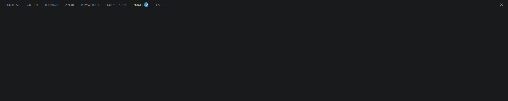
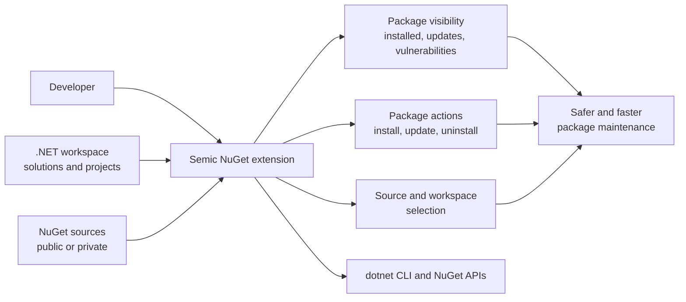

# Semic NuGet (.NET)

Visual Studio Code extension for browsing NuGet v3 feeds and managing packages used by .NET projects in the current workspace.

## Demo




## Features

- Opens a dedicated `NUGET` panel in the VS Code panel area.
- Loads projects from a selected `.sln` or `.slnx` file.
- Can scan all `.csproj` files in the workspace when solution-based loading is disabled.
- Stores workspace project loading settings under shared `semicDotnet.workspace.*` settings, so other Semic .NET extensions can use the same solution/project mode.
- Reads `PackageReference` entries from projects.
- Supports central package versions from the nearest `Directory.Packages.props`.
- Reads NuGet sources through `dotnet nuget list source`.
- Supports adding, updating and removing NuGet sources from the settings panel.
- Searches HTTP NuGet v3 sources from the Browse tab.
- Supports source selection, including `All` enabled sources.
- Shows package details, README, versions, dependencies, downloads and verified status when available from the feed.
- Shows installed packages, updates, consolidated version differences and vulnerabilities.
- Installs, updates and uninstalls packages through the .NET CLI.

## Architecture

At a higher level, the extension sits between the developer workspace and NuGet sources, giving one place to inspect package state and apply changes across projects.



In implementation terms:

- `webview/src/App.tsx` and `webview/src/Components/*` render the interface and keep UI state.
- `src/Panels/NugetPanel.ts` is the bridge between the UI and the extension host.
- `src/Services/*` contains the workspace scanning, project parsing and NuGet operations.
- `src/Types/SharedTypes.ts` defines the message contract shared by both sides.

## Workspace Loading

On first run, the extension tries to find the first least-nested `.sln` or `.slnx` file in the workspace. If no solution file exists, it falls back to scanning all `.csproj` files.

After the first run, the selected mode is stored in workspace settings and is reused on later starts.

Shared settings:

```json
{
  "semicDotnet.workspace.useAllProjects": false,
  "semicDotnet.workspace.discoveryInitialized": true
}
```

These settings are stored globally. The selected `.sln` or `.slnx` path is session-only and is not persisted to settings. After restarting VS Code, the extension discovers the least-nested solution again unless `Use all .csproj projects` is enabled.

You can change the project loading mode from the extension settings panel under the gear icon:

- `Use all .csproj projects` disables solution-based loading.
- The `Solution` dropdown lets you choose a `.sln` or `.slnx` file for the current VS Code session when solution-based loading is enabled.

## NuGet Sources

The extension reads sources from:

```bash
dotnet nuget list source
```

Default source setting:

```json
{
  "semicDotnetNuget.source": "__all__"
}
```

Use `__all__` to search all enabled HTTP NuGet v3 sources.

Only HTTP NuGet v3 feeds expose searchable package metadata, README and package details in the Browse/details views. Local/offline sources can still be listed and used by the .NET CLI where supported.

## Requirements

- VS Code 1.116+
- .NET SDK available on `PATH`
- Node.js 20+ for development

## Development

Install dependencies:

```bash
npm install
```

Run validation:

```bash
npm run lint
```

Build extension host and webview assets:

```bash
npm run compile
```

Package VSIX:

```bash
npm run package
```

Start local development:

1. Open this folder in VS Code.
2. Run `npm run compile`.
3. Press `F5`.
4. In the Extension Development Host run `Semic NuGet: Open`.

## Commands

- `Semic NuGet: Open`
- `Semic NuGet: Refresh`
